# IS601 - Web App 3
This project is a homework assignment to get Pycharm working with Docker, Flask, and MySQL.

# Running WebApp
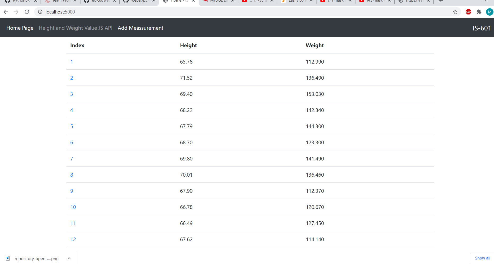

# Table in Pycharm
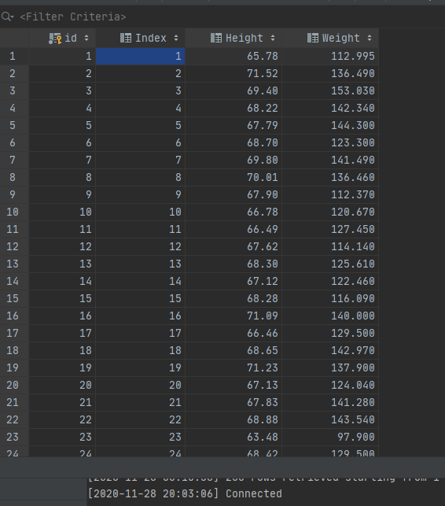

# View Record
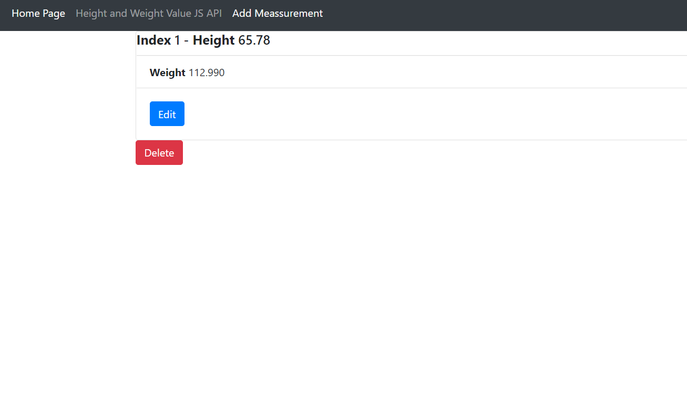

# Edit
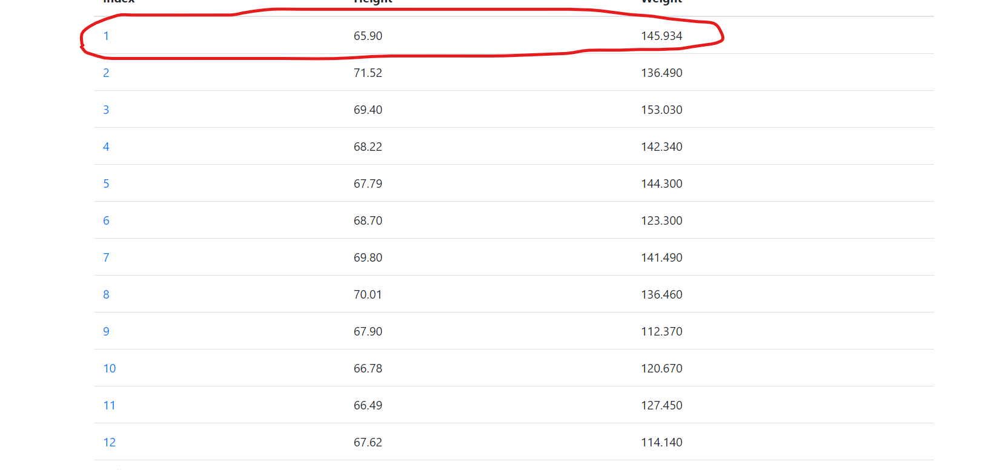 

# Delete (Index 1 deleted)

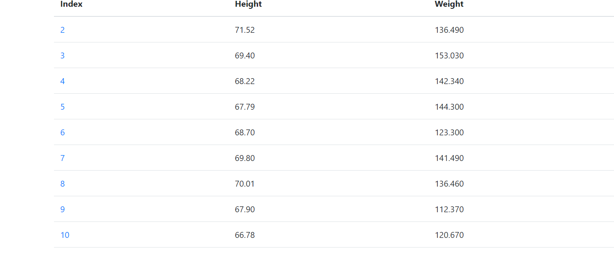

# IS601 - Web App 4

# Records
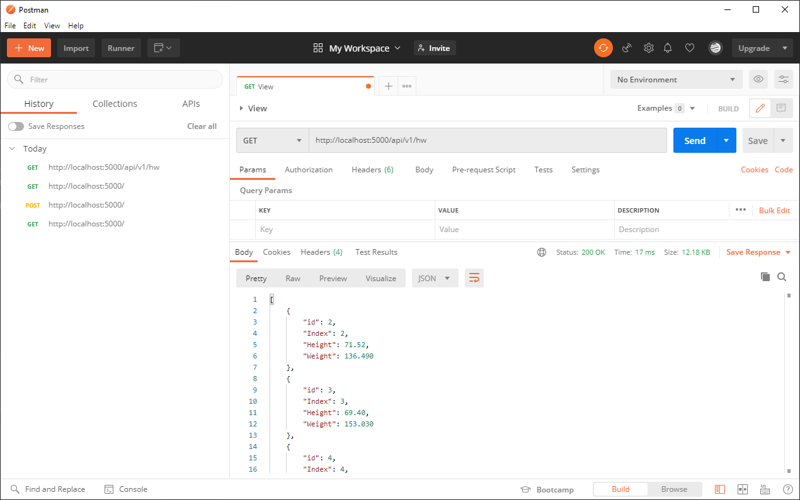

# Single Record
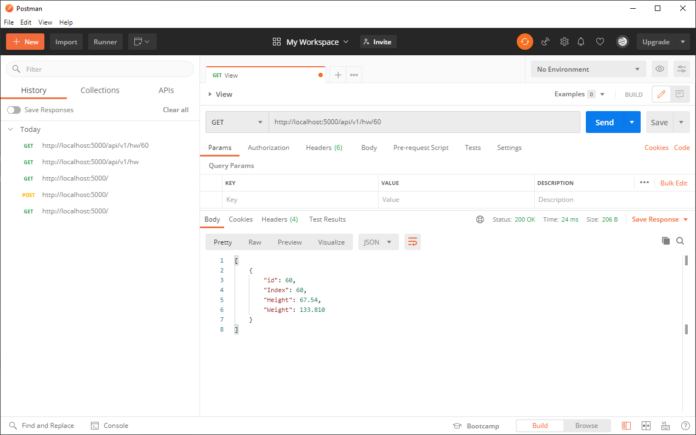

# Add Records with Confirmation

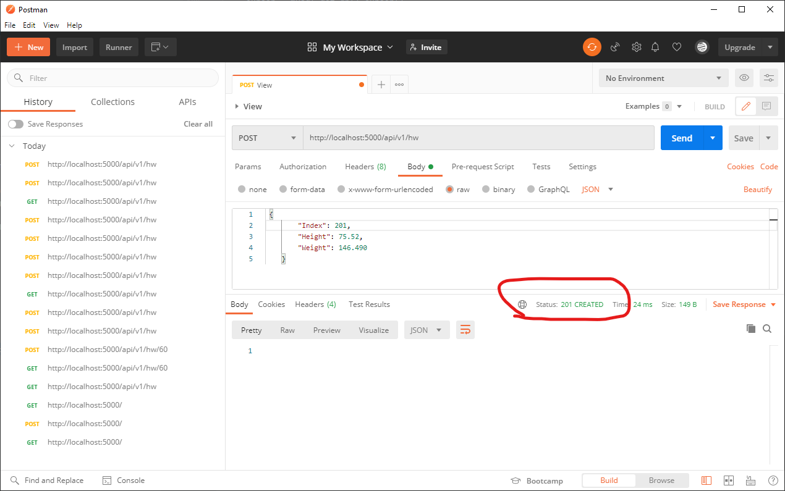

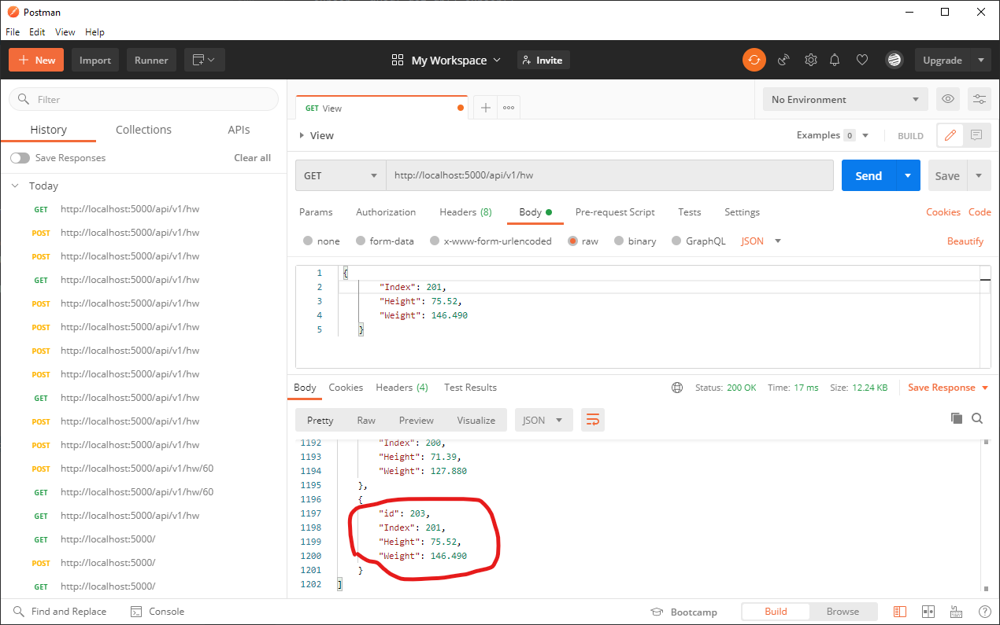

# Edit with Confirmation

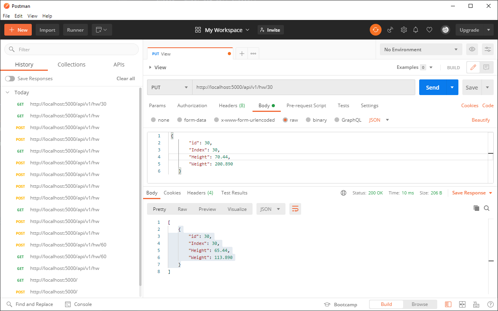

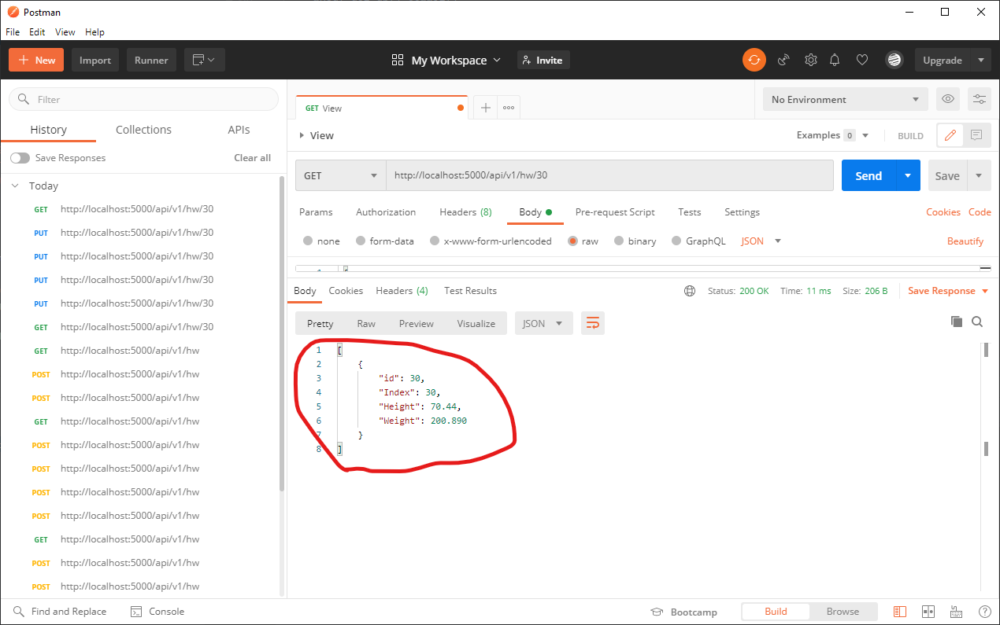

# Delete with Confirmation

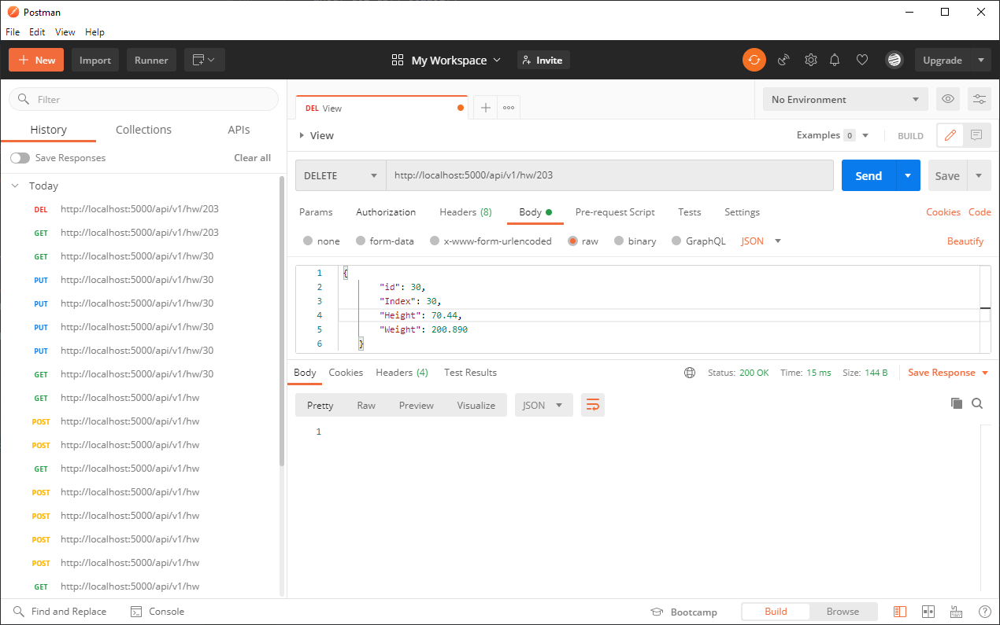

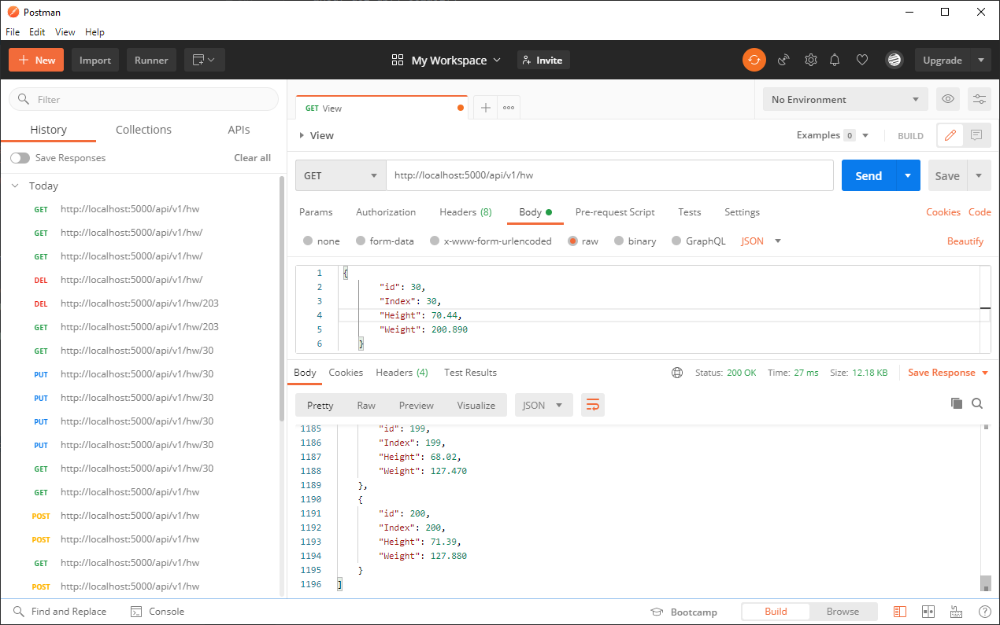

